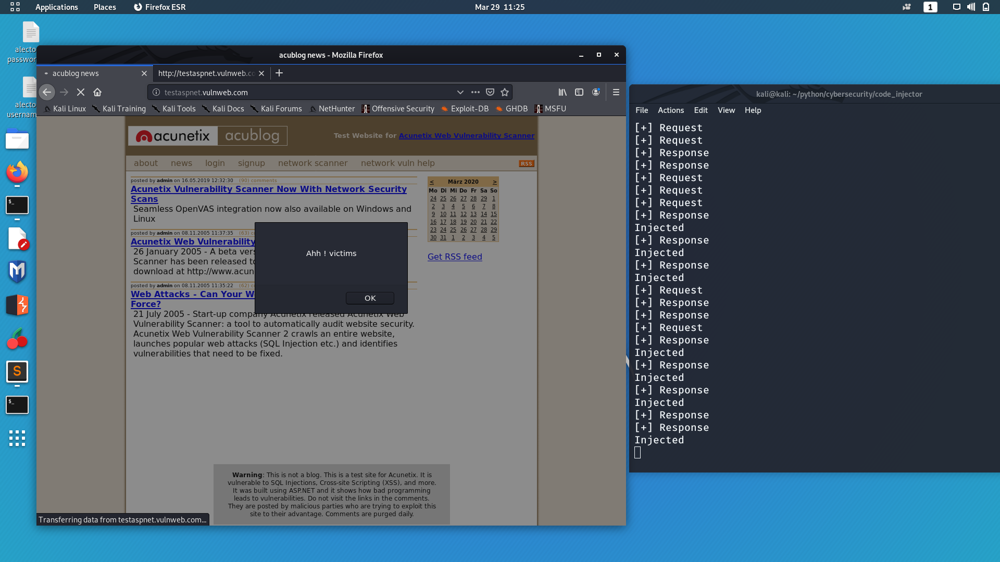
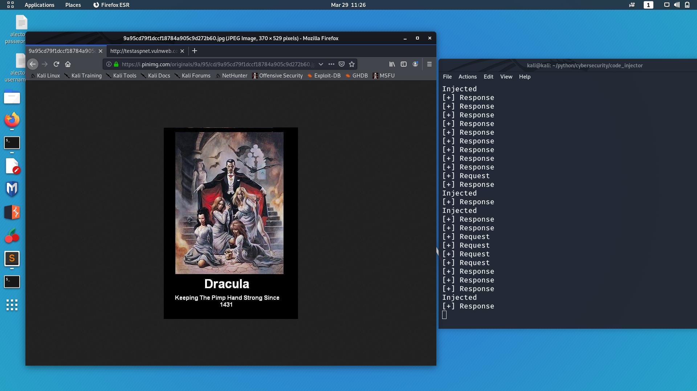

# Code_injector

sudo python code_injector.py -js source/code.js -a "</html>
Inject some js code in browser that is wisiting some http seb site.
Use with arp spoofer

usage: code_injector.py [-h] [-js JSCODE_FILE] [-a ANCHORTAG]

optional arguments:
  -h, --help            show this help message and exit
  
  -js JSCODE_FILE, --jscode_file JSCODE_FILE
  
                        The code to inject
                        
  -a ANCHORTAG, --anchorTag ANCHORTAG
  
                        The tag to initialise injection

Can take direct script or some file that has some script inside

It will auto matically run iptables -I FORWARD -j NFQUEUE --queue-num 0
to get all the trafic from other machine to a specific quueue

To practice on ypur machine uncomment lines 63, 64 and comment line 66

Keep in mind that the anchor tag must be in the web page and the js will be in jected right next to it so <html> will make the js to execute first and </html> in last.

For fun 
Try : sudo python code_injector.py -js source/code.js -a "</HTML>"

